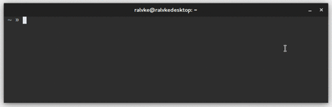

# cargo-find [](https://crates.io/crates/cargo-find) [](https://travis-ci.org/Ralvke/cargo-find)
Find crates from command line

## Use
```
cargo install cargo-find
cargo find <crate name>
```

## Demo

